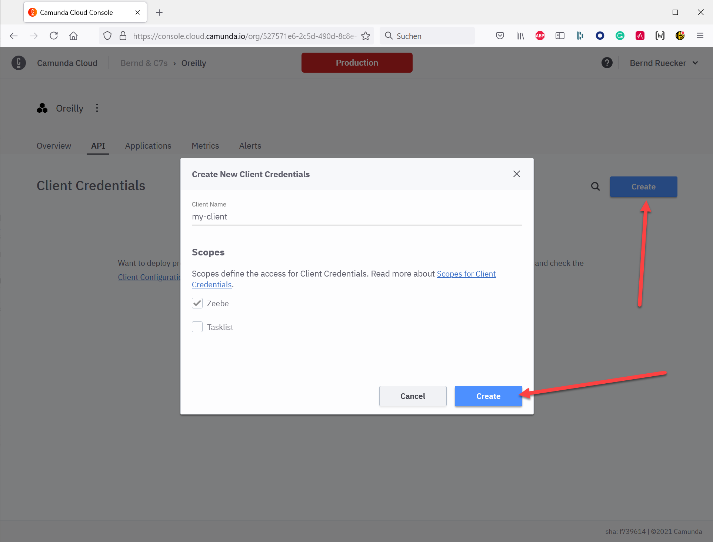
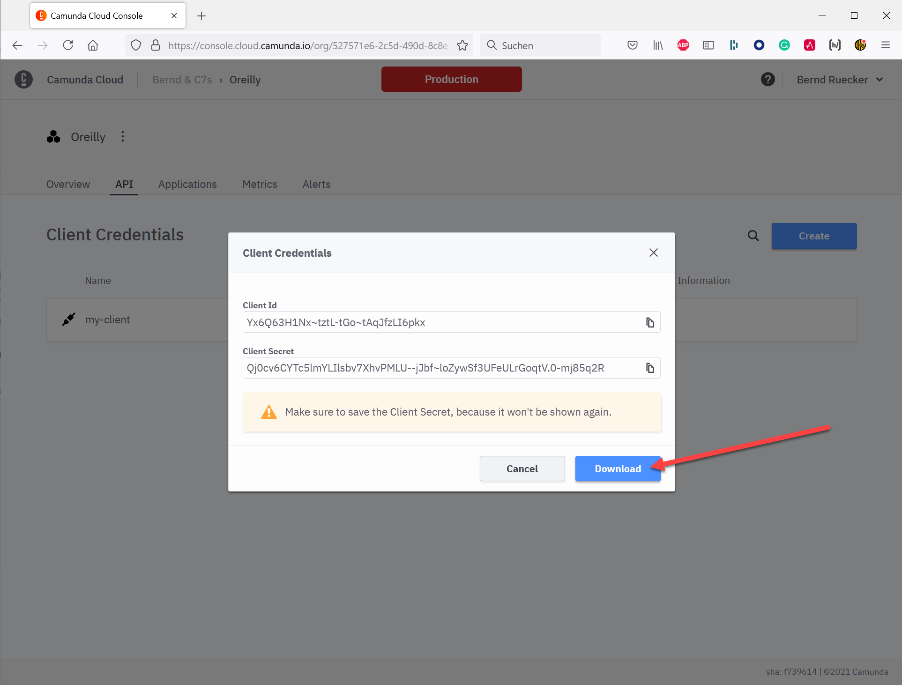
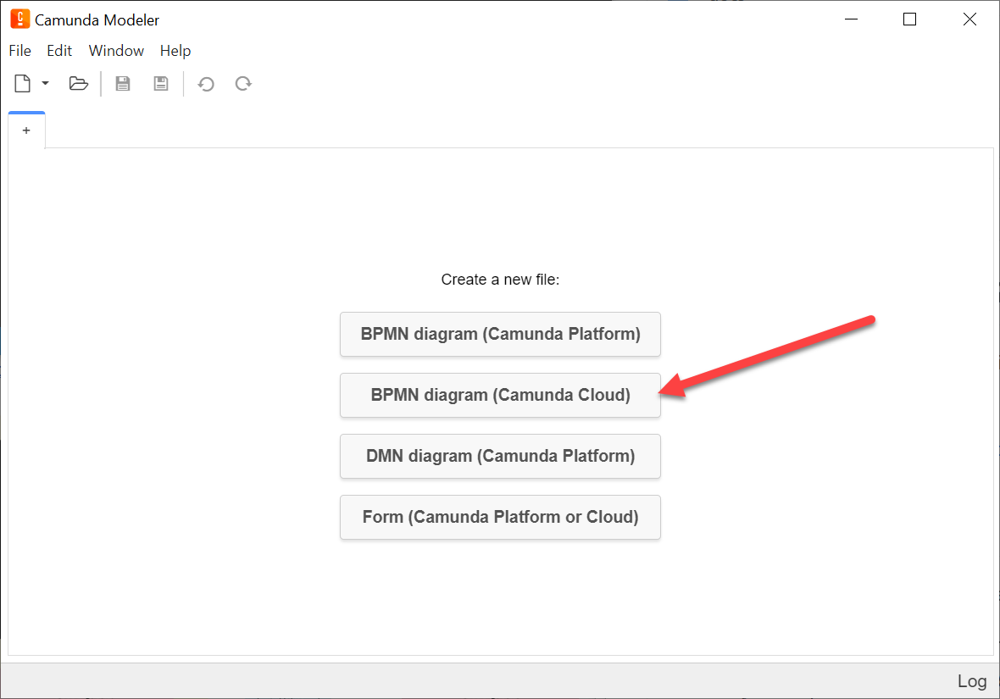
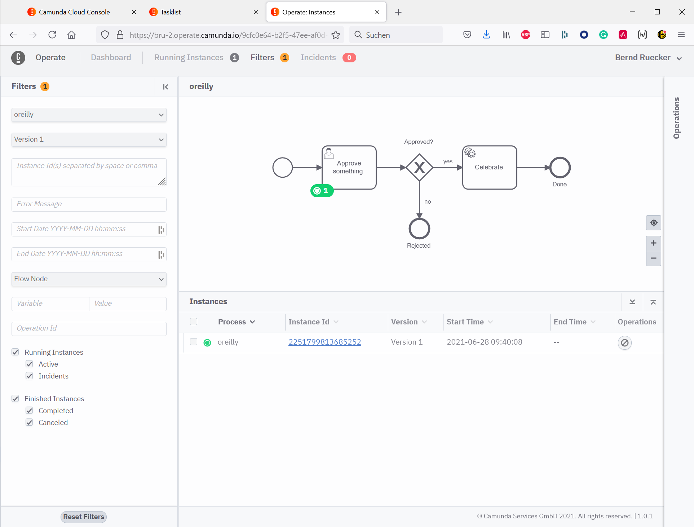
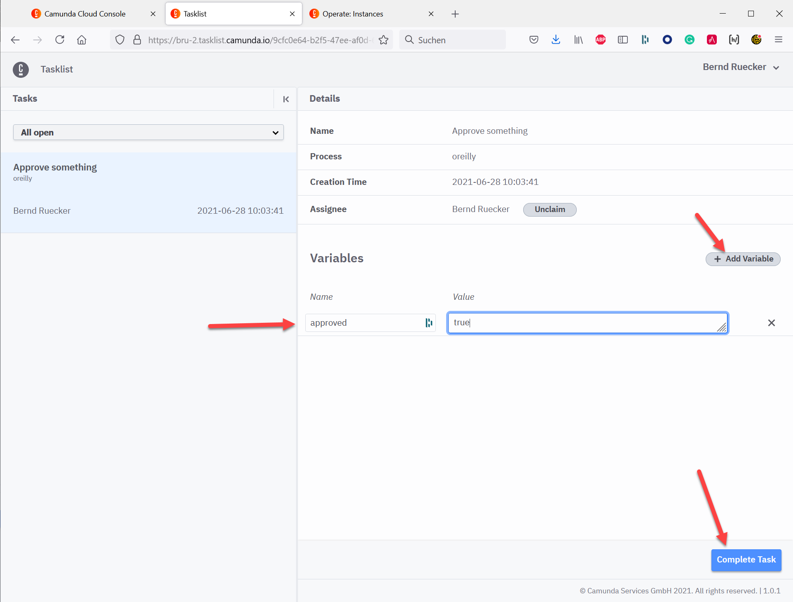

# Training "Process Automation in Modern Architectures"

If you have any questions while doing the lab:

* Ask via chat in the training
* Ask in the Camunda Cloud Forum: https://forum.camunda.io/

# Lab 1: Execute Your First BPMN Process

You have two options doing this lab, depending on your level of interest:

1. **Run on Camunda Cloud (managed workflow engine)**: You will use a managed environment in the cloud, but still can model and deploy yourself and write some code in Java, NodeJS or C# in a later step. You should prefer this approach if you want to get your hands dirty at least a bit to understand how it is really working.
2. **Watch the recording**: You can simply watch a walk through recording

## Option 1: Camunda Cloud

### Step 1: Create Managed Workflow Engine

* Create a free account within Camunda Cloud via https://console.cloud.camunda.io/. You will start a 30-days trial to play around with it for free.

* Create a "Zeebe Broker", which is the managed workflow engine within Camunda Cloud. You can simply use a "Development" cluster:

* Create API/Client credentials to be able to connect to that cluster from the outside (e.g. Camunda Modeler or service tasks in lab2):

You can download these credentials to be sure to have them later when you need them:

### Step 1: Camunda Modeler

Download the Camunda Modeler and follow the installation instructions found here: https://camunda.com/download/modeler/.

### Step 2: Model the BPMN, deploy and run it

Model your first BPMN process using the Camunda Modeler. Make sure to create a BPMN model that targets Camunda Cloud:

Your model shall contain a *user task*, an *XOR gateway* and a *service task*. If you struggle, you can find the recording below, that will walk you through it. Note, that this training does not focus on user tasks or user forms, so we will use only a very simplistic version of user tasks.

In order to configure the process model for execution

* Adjust the process definition id. Click somewhere in the blank area on your process model to do this. Use e.g. `oreilly`, as seen above.

* Configure the XOR gateway (decision) point by adding an expression to both outgoing sequence flows (arrows). One should be `= approved` and the other one `= approved=false`

* Configure the service task type. You can basically name it as you like, e.g. `celebrate`:

* Deploy the model to Camunda Cloud, therefor change the target to "Camunda Cloud" and enter the endpoint details you just downloaded earlier for your cluster. Mark the checkbox to save these connection information for later:

* You can now start a new process instance from the modeler:

* Go to Operate from your Camunda Cloud Console to inspect your just started process instances, waiting in the user task:

* Go to Tasklist from your Camunda Cloud Console and you will find a user task waiting for approval:
  * Click on `claim` 
  * Add variable `approved` with value `true` or `false`

* If you go back to Operate you will see the process instance waiting to `celebrate`, which we will do in lab2. 

Congrats!

## Option 2: Watch Recording

# Lab 2: Implement a Service Task

You have many options to implement the behavior behind the service task. Follow the instructions for the language you prefer below. The labs assume that you have the necessary envirionment for that programming language already installed on your machine!

1. Java Worker: [demo/worker-java/](demo/worker-java/)
2. NodeJS Worker: [demo/worker-nodejs/](demo/worker-nodejs/)
3. C# Worker: [demo/worker-csharp/](demo/worker-csharp/)
5. Watch the recording:

